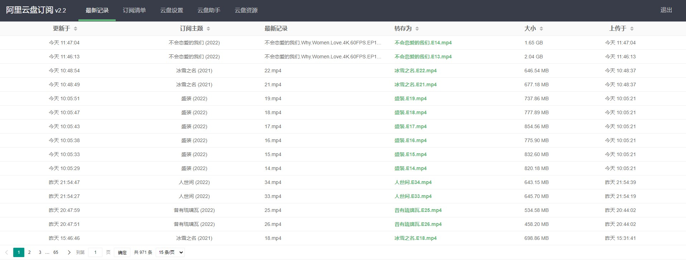
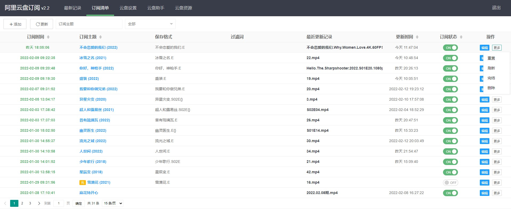
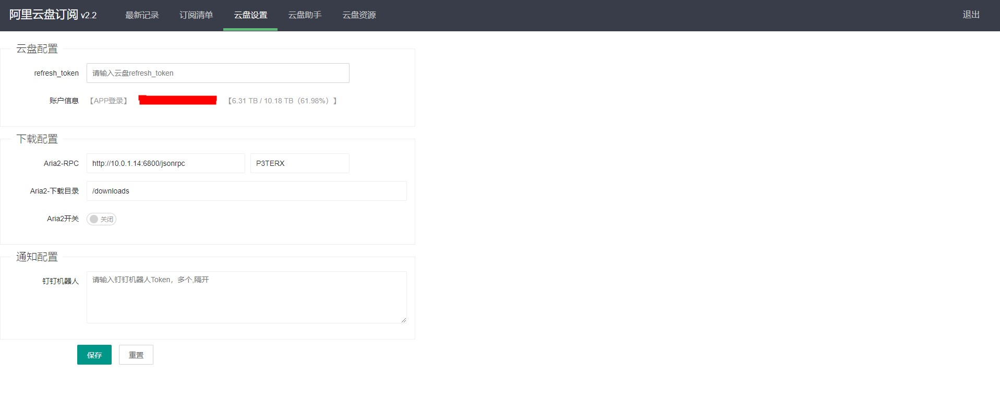
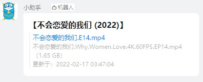
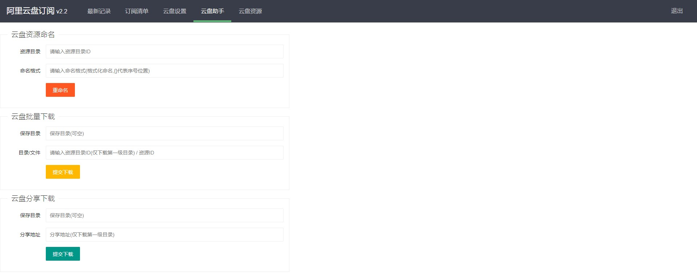
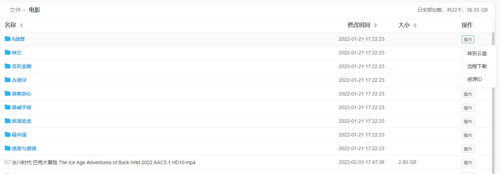
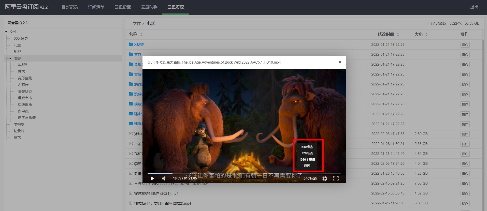
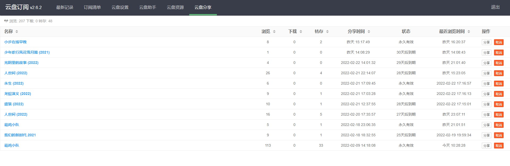

# aliyundrive-subscribe

【阿里云盘订阅】，主要用于云盘分享链最新资源转存、重命名、下载、资源管理等

配置说明：
config/app.ini
```ini
[app]
app-http-port      = 8002
# 用户名
app-auth-pass      = admin
# 密码
app-auth-user      = admin
# 数据库 (mysql/sqlite3) mysql root:pass@tcp(ip:port)/database?charset=utf8&parseTime=True&loc=Local
app-database       = conf/data.db
# 订阅检查周期: @every 30m(30分钟); @every 1h(1小时) - 不要太频繁
app-check-interval = @every 30m
# 订阅检查并发数
app-max-procs      = 10
# 缓存，在线播放m3u8资源目录, 会4小时自动清除
app-cache-dir      = conf/cache
# 钉钉机器人通知
app-dingding-robot = [app-dingding-robot]
# 钉钉机器人附带外链播放地址, 为当前服务访问地址
app-play-url       = http://10.0.1.18:8002
# 授权 暂时防止后面不可控因素，目前到4月1日，到期会发新的，稳定后会移除这个限制
app-authorize      = 5udTtvExK9dXA2wODRZLlkWc/oOE+CASS94KaoK3Q3M=

[aliyundrive]
# 云盘refresh-token
aliyundrive-refresh-token = [refresh-token]
# 云盘资源根目录（默认root），建议设置一个单独目录
aliyundrive-root          = root

[aria2rpc]
# aria2地址（仅支持http）
aria2-rpc-url          = http://10.0.1.14:6800/jsonrpc
# aria2秘钥，没有留空
aria2-rpc-secret       = P3TERX
# aria2下载根目录，所有下载都在这个目录下
aria2-rpc-download-dir = /downloads
# aria2是否启用下载
aria2-rpc-enable       = false
```

### 最新记录

订阅链转存记录



### 订阅清单
【功能】
- 订阅链（添加、删除、编辑）、更新（刷新所有订阅）
- 云盘转存重置（清空云盘对应目录资源，重置订阅记录）
- 刷新（重新拉取订阅资源并自动转存）
- 完结（手动设为完结，若订阅链有完结`文件`标识，则自动设置完结）
- 分享（30天限时分享）
- 远程下载（Aria2远程配置并启用，订阅中开启下载）
- 列表跳转：订阅时间（转存目录）；订阅主题（订阅链目录）最近更新记录（订阅记录列表）

【说明】
- 下载目录：多级/隔开，此目录位于Aria2下载目录下
- 截至记录ID：若不需要全部订阅，从订阅链找出截止文件ID录入后，订阅仅从此文件开始转存
- 过滤词：根据关键字屏蔽资源，多个,（英文）隔开
- 保存名称：为空，则不改变名称；可添加{}，标识序号占位，序号为资源排序；针对E、EP等资源，自动识别剧集，可使用E或者EP结尾自动命名
- 保存目录ID：自己云盘目录ID，需要手动去先创建（云盘资源）再获取对应目录ID
- 订阅地址：订阅链地址，必须为目录，且只订阅该目录下资源，子目录不转存（后面也不会增加递归功能）

【命名】
```bash
01.mp4  -->  不会恋爱的我们.E  -->  不会恋爱的我们.E01.mp4
01.mp4  -->  不会恋爱的我们_第{}集  -->  不会恋爱的我们_第01集.mp4
不会恋爱的我们.Why.Women.Love.4K.60FPS.EP01.mp4  -->  不会恋爱的我们.E  -->  不会恋爱的我们.E01.mp4
```



### 云盘设置
【云盘配置】
- refresh_token：【网页】、【APP】登录两种；网页：F12获取，APP：抓包（教程很多）

注：APP登录Token支持原画播放、网页登录模式不支持（最高1080P），原画H265可能有声音没画面，请注意

【下载配置】
- Aria2远程下载配置及开关

【通知配置】
- 钉钉机器人：多个Token逗号隔开(英文,)

注：有其它免费通知欢迎提出（免费次数多或者不限制哦）




### 云盘助手
- 云盘资源命名：主要为格式化现有资源命名

- 云盘批量下载：通过Aria2远程下载现有自己云盘资源（支持文件夹、单个文件）

- 云盘分享下载：直接从分享链接下载，不转存到自己云盘

- 福利码兑换



### 云盘资源

简单的云盘资源操作，默认加载云盘根目录（root），如果需要限制显示的目录，请在**app.ini/[aliyundrive]aliyundrive-root**设置目录ID

- 新建文件夹
- 删除
- 重命名
- 目录或文件资源下载
- 资源ID





### 云盘分享

- 列表、统计、[分享、取消]
- 所有分享



## 免责声明
1. 本软件为免费开源项目，无任何形式的盈利行为。
2. 本软件服务于阿里云盘，旨在让阿里云盘功能更强大。如有侵权，请与我联系，会及时处理。
3. 本软件皆调用官方接口实现，无任何“Hack”行为，无破坏官方接口行为。
5. 本软件仅做流量转发，不拦截、存储、篡改任何用户数据。
6. 严禁使用本软件进行盈利、损坏官方、散落任何违法信息等行为。
7. 本软件不作任何稳定性的承诺，如因使用本软件导致的文件丢失、文件破坏等意外情况，均与本软件无关。
